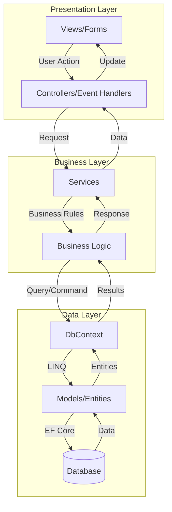
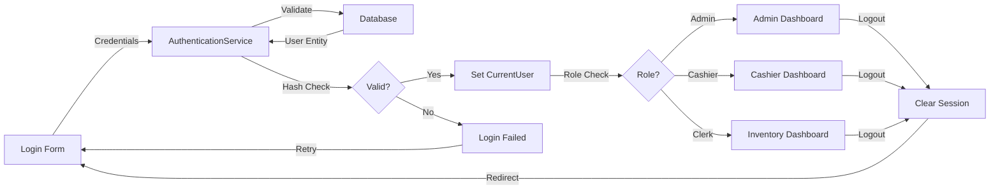
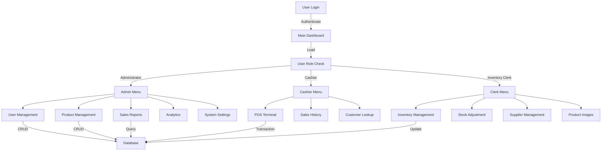
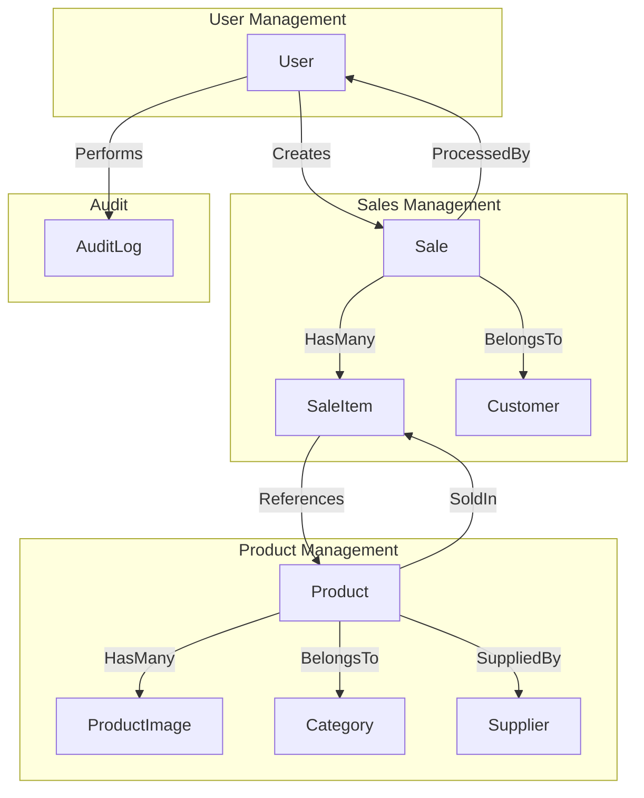

# SYNCVERSE STUDIO - Point of Sale System

A comprehensive desktop Point of Sale (POS) system built with .NET 8 and Windows Forms, designed for retail businesses to manage sales, inventory, customers, and operations efficiently.

TEST: Hello from GTCAT

## Project Overview

SyncVerse Studio is a modern, feature-rich POS application that provides complete business management capabilities including real-time sales processing, inventory tracking, customer management, and detailed reporting. The system implements role-based access control with dedicated interfaces for Administrators, Cashiers, and Inventory Clerks.

## Key Features

- Multi-user authentication with role-based access control
- Real-time sales processing with multiple payment methods
- Comprehensive inventory management with image support
- Customer relationship management with purchase history
- Product categorization and supplier management
- Sales reporting and analytics
- Barcode generation and scanning support
- Multi-image product support with primary image selection
- Audit logging for security and compliance
- Modern, intuitive user interface

## Technology Stack

### Core Framework

- .NET 8.0 (Windows Desktop)
- Windows Forms for UI
- C# 12

### Database

- Entity Framework Core 8.0
- SQL Server LocalDB
- Code-First approach with migrations

### UI Components

- FontAwesome.Sharp 6.3.0 for icons
- MaterialSkin.2 2.1.0 for modern UI elements
- Custom-drawn controls with GDI+

### Architecture

- Model-View-Controller (MVC) pattern
- Repository pattern for data access
- Service layer for business logic
- Dependency injection for loose coupling

## Installation and Setup

### Git Commands

Here are some useful Git commands for managing the SyncVerse Studio project:

1. **Clone the repository:**

   ```bash
   git clone https://github.com/yourusername/syncverse-studio.git
   ```

2. **Check the status of your repository:**

   ```bash
   git status
   ```

3. **Add changes to staging:**

   ```bash
   git add .
   ```

4. **Commit changes with a message:**

   ```bash
   git commit -m "Update README with Git commands"
   ```

5. **Push changes to the remote repository:**

   ```bash
   git push origin main
   ```

6. **Pull the latest changes from the remote repository:**

   ```bash
   git pull origin main
   ```

7. **Create a new branch:**

   ```bash
   git checkout -b feature/new-feature
   ```

8. **Switch to an existing branch:**

   ```bash
   git checkout develop
   ```

9. **Merge a branch into the current branch:**

   ```bash
   git merge feature/new-feature
   ```

10. **View commit history:**
    ```bash
    git log --oneline
    ```

### Prerequisites

- Windows 10 or later
- .NET 8.0 SDK or Runtime
- SQL Server LocalDB (included with Visual Studio)
- Visual Studio 2022 or later (recommended)

### Installation Steps

3. Update database connection string (if needed)
   Edit `syncversestudio/Data/ApplicationDbContext.cs` and modify the connection string

4. Apply database migrations

```bash
dotnet ef database update --project syncversestudio
```

5. Build the solution

```bash
dotnet run --project syncversestudio/syncversestudio.csproj
```

6. Run the application and fix

```bash
dotnet run --project syncversestudio/syncversestudio.csproj
```

### Default Login Credentials

After initial setup, use these credentials:

- Administrator:
- Cashier:
- Inventory dsClerk:

## Build and Run

### Development Build

```bash
dotnet build syncversestudio/syncversestudio.csproj --configuration Debug
```

### Production Build

```bash
dotnet build syncversestudio/syncversestudio.csproj --configuration Release
```

### Run Application

```bash
cd syncversestudio/bin/Debug/net8.0-windows
./syncversestudio.exe
```

### Create Migrations

```bash
dotnet ef migrations add MigrationName --project syncversestudio
```

### Update Database

```bash
dotnet ef database update --project syncversestudio
```

## System Architecture

The application follows a layered architecture pattern with clear separation of concerns:

### Layer Structure

**Presentation Layer (Views)**

- Windows Forms UI components
- User interaction handling
- Data binding and validation

**Business Logic Layer (Services)**

- AuthenticationService: User authentication and session management
- Business rules and validation
- Transaction coordination

**Data Access Layer (Data)**

- ApplicationDbContext: EF Core database context
- Entity configurations
- Database migrations

**Domain Layer (Models)**

- Entity classes
- Business objects
- Enumerations

### MVC Flow Diagram



### Security Flow



### Dashboard Data Flow



### Entity Relationship Flow



## Database Schema and Entity Relationships

### Core Entities

**User**

- Id (PK, Identity)
- Username (Unique, Required)
- PasswordHash (Required)
- FirstName, LastName
- Email
- Role (Enum: Administrator, Cashier, InventoryClerk)
- IsActive
- CreatedAt, UpdatedAt

**Product**

- Id (PK, Identity)
- Name (Required)
- Description
- Barcode, SKU
- CategoryId (FK)
- SupplierId (FK)
- CostPrice, SellingPrice
- Quantity, MinQuantity
- IsActive
- CreatedAt, UpdatedAt

**ProductImage**

- Id (PK, Identity)
- ProductId (FK, Required)
- ImagePath (Required)
- IsPrimary (Boolean)
- CreatedAt, UpdatedAt

**Category**

- Id (PK, Identity)
- Name (Required, Unique)
- Description
- IsActive
- CreatedAt, UpdatedAt

**Supplier**

- Id (PK, Identity)
- Name (Required)
- ContactPerson
- Phone, Email
- Address
- IsActive
- CreatedAt, UpdatedAt

**Customer**

- Id (PK, Identity)
- FirstName, LastName
- Email, Phone
- Address
- LoyaltyPoints
- CreatedAt, UpdatedAt

**Sale**

- Id (PK, Identity)
- InvoiceNumber (Unique, Required)
- CashierId (FK, Required)
- CustomerId (FK, Optional)
- TaxAmount, TotalAmount
- PaymentMethod (Enum: Cash, Card, Mobile)
- Status (Enum: Pending, Completed, Cancelled, Refunded)
- SaleDate
- CreatedAt, UpdatedAt

**SaleItem**

- Id (PK, Identity)
- SaleId (FK, Required)
- ProductId (FK, Required)
- Quantity
- UnitPrice, TotalPrice
- CreatedAt, UpdatedAt

**AuditLog**

- Id (PK, Identity)
- UserId (FK, Required)
- Action (Required)
- EntityName
- EntityId
- OldValues, NewValues (JSON)
- IpAddress
- Timestamp

### Relationships

- User 1:N Sale (One user processes many sales)
- Customer 1:N Sale (One customer has many sales)
- Sale 1:N SaleItem (One sale contains many items)
- Product 1:N SaleItem (One product appears in many sales)
- Product N:1 Category (Many products belong to one category)
- Product N:1 Supplier (Many products from one supplier)
- Product 1:N ProductImage (One product has many images)
- User 1:N AuditLog (One user generates many audit logs)

## System Workflow and Data Flow

### Sales Transaction Flow

1. Cashier logs in to POS terminal
2. Searches and selects products
3. Products added to shopping cart
4. Customer information entered (optional)
5. Payment method selected
6. Transaction validated
7. Sale record created
8. Inventory automatically updated
9. Receipt generated
10. Transaction logged in audit trail

### Inventory Management Flow

1. Inventory clerk logs in
2. Accesses product management
3. Creates/updates product information
4. Adds product images
5. Sets primary image
6. Saves product data
7. Images stored in assets folder
8. Database updated with image paths
9. Stock levels tracked
10. Low stock alerts generated

### User Authentication Flow

1. User enters credentials
2. System validates username
3. Password hash compared
4. User role retrieved
5. Session established
6. Role-based dashboard loaded
7. Menu options filtered by permissions
8. User actions logged
9. Session maintained until logout
10. Logout clears session data

## User Role Permissions

### Administrator

- Full system access
- User management (CRUD)
- Product management (CRUD)
- Category management (CRUD)
- Supplier management (CRUD)
- Customer management (CRUD)
- Sales reports and analytics
- System configuration
- Audit log viewing
- Database management

### Cashier

- POS terminal access
- Process sales transactions
- View sales history
- Customer lookup
- Product search
- Receipt printing
- Limited product viewing
- No administrative functions

### Inventory Clerk

- Product management (CRUD)
- Product image management
- Stock adjustment
- Supplier management
- Category management
- Inventory reports
- Barcode generation
- No sales processing
- No user management

## Entity Framework Configuration

### DbContext Configuration

The ApplicationDbContext is configured with:

- Connection string to SQL Server LocalDB
- Entity configurations via Fluent API
- Automatic timestamp handling
- Cascade delete rules
- Index definitions for performance
- Default value specifications

### Key Configurations

**Product Entity**

```csharp
modelBuilder.Entity<Product>()
    .HasOne(p => p.Category)
    .WithMany(c => c.Products)
    .HasForeignKey(p => p.CategoryId)
    .OnDelete(DeleteBehavior.SetNull);

modelBuilder.Entity<Product>()
    .HasMany(p => p.ProductImages)
    .WithOne(pi => pi.Product)
    .HasForeignKey(pi => pi.ProductId)
    .OnDelete(DeleteBehavior.Cascade);
```

**Sale Entity**

```csharp
modelBuilder.Entity<Sale>()
    .HasOne(s => s.Cashier)
    .WithMany()
    .HasForeignKey(s => s.CashierId)
    .OnDelete(DeleteBehavior.Restrict);

modelBuilder.Entity<Sale>()
    .HasMany(s => s.SaleItems)
    .WithOne(si => si.Sale)
    .HasForeignKey(si => si.SaleId)
    .OnDelete(DeleteBehavior.Cascade);
```

### Migration Strategy

- Code-First approach
- Incremental migrations for schema changes
- Data seeding for initial setup
- Version control for migration files
- Rollback capability for failed migrations

## Development Guide

### Project Structure

```
syncversestudio/
├── Data/
│   ├── ApplicationDbContext.cs
│   └── Migrations/
├── Models/
│   ├── User.cs
│   ├── Product.cs
│   ├── Sale.cs
│   └── ...
├── Services/
│   └── AuthenticationService.cs
├── Views/
│   ├── LoginForm.cs
│   ├── MainDashboard.cs
│   ├── CashierPOSView.cs
│   └── ...
├── Helpers/
│   ├── ProductImageHelper.cs
│   ├── BrandTheme.cs
│   └── ...
└── Program.cs
```

### Coding Standards

- Follow C# naming conventions
- Use async/await for database operations
- Implement proper error handling
- Add XML documentation comments
- Use dependency injection where applicable
- Keep methods focused and concise
- Implement proper disposal patterns

### Adding New Features

1. Create/update entity models
2. Add migration if schema changes
3. Update DbContext if needed
4. Create/update service layer
5. Implement UI forms/views
6. Add event handlers
7. Implement validation
8. Add error handling
9. Test functionality
10. Update documentation

### Testing Guidelines

- Test all CRUD operations
- Verify role-based access control
- Test transaction rollback scenarios
- Validate input handling
- Test concurrent user scenarios
- Verify data integrity
- Test error handling
- Validate UI responsiveness

### Performance Optimization

- Use async operations for database calls
- Implement pagination for large datasets
- Use eager loading for related entities
- Cache frequently accessed data
- Optimize database queries
- Use indexes on foreign keys
- Implement connection pooling
- Monitor and log performance metrics

## Contributing

Contributions are welcome. Please follow these guidelines:

1. Fork the repository
2. Create a feature branch
3. Follow coding standards
4. Add appropriate tests
5. Update documentation
6. Submit pull request

## License

This project is proprietary software. All rights reserved.

## Support

For support and questions, please contact the development team.

## Version History

- v2.1.0 - Current version with enhanced POS interface
- v2.0.0 - Major UI redesign and feature additions
- v1.0.0 - Initial release

## Acknowledgments

Built with modern .NET technologies and best practices for enterprise-level retail management.
