# SYNCVERSE STUDIO

Point of Sale and Inventory Management System

A comprehensive retail management solution built with .NET 8.0 and Windows Forms.

---

## Overview

SYNCVERSE STUDIO is an enterprise-grade POS system that handles sales processing, inventory management, customer relationships, invoicing, and analytics.

Version: 1.0.0
Platform: Windows Desktop
Framework: .NET 8.0

---

## System Architecture

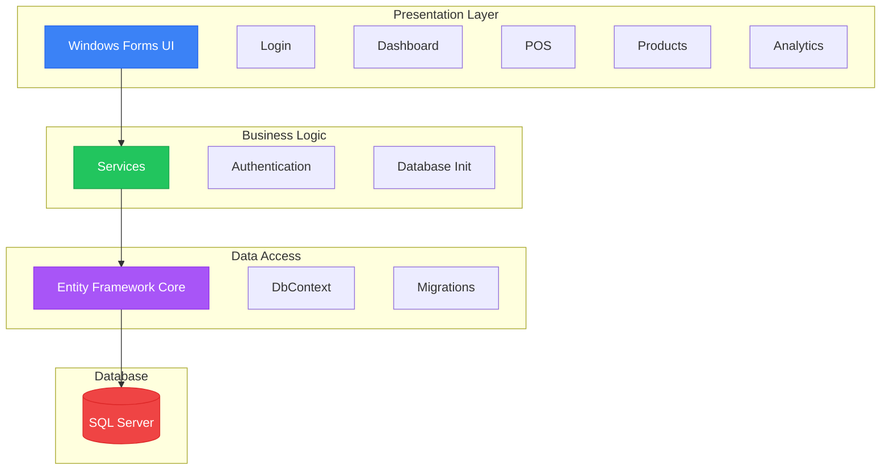

---

## User Roles

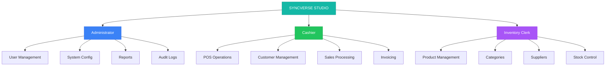

---

## Application Flow

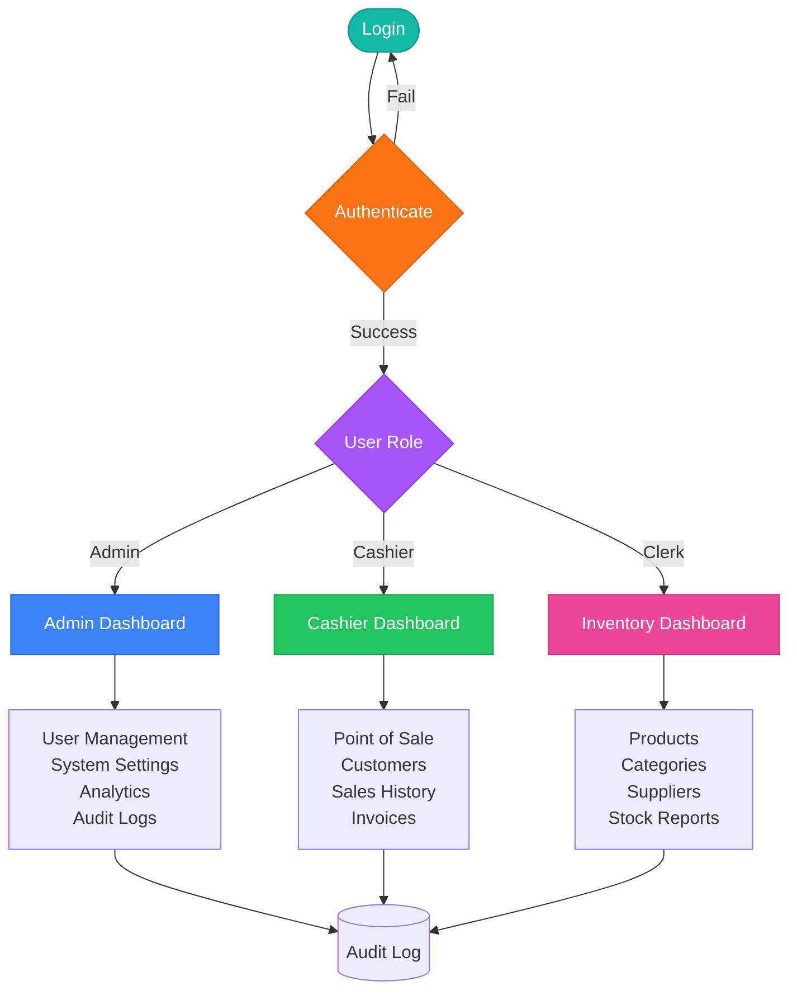

---

## POS Transaction Flow

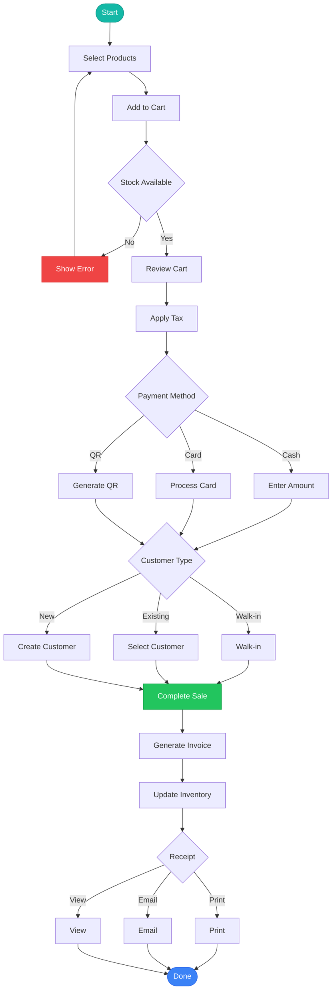

---

## Database Schema

### Complete Entity Relationship Diagram

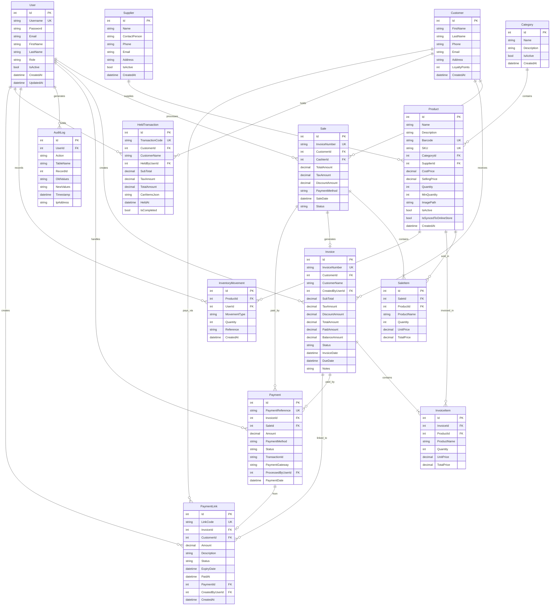

### Data Table Relationships Explained

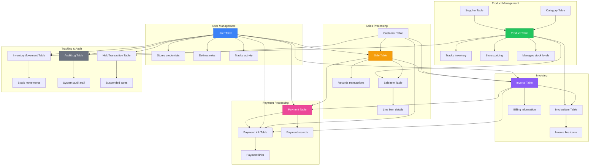

---

## Data Presentation Interface

### How Data Flows Through the System

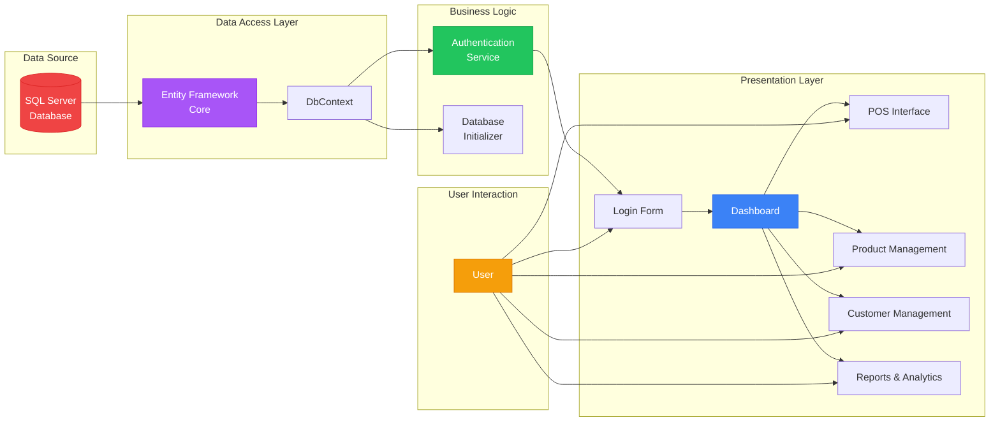

### Data Flow in POS Transaction

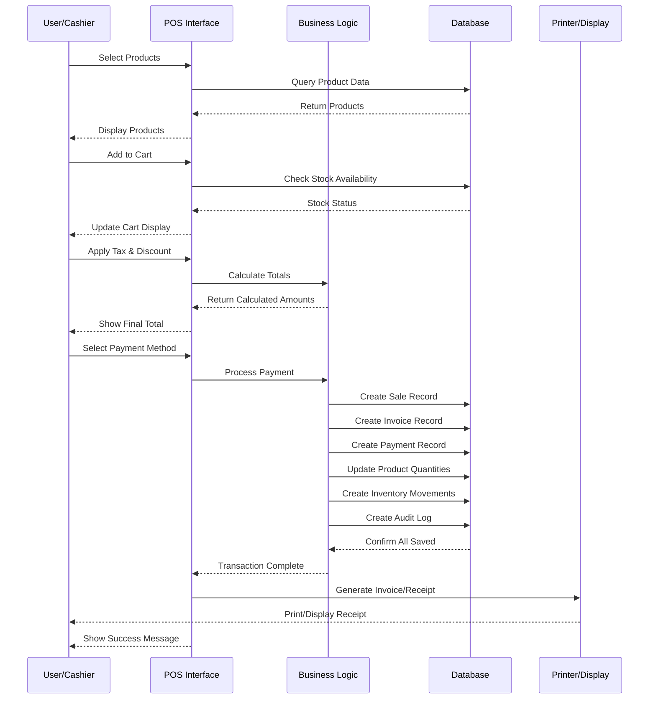

### Detailed POS Transaction Data Flow

```mermaid
flowchart TD
    Start([Cashier Opens POS]) --> Init[Initialize POS Interface]
    Init --> LoadData[Load Initial Data]
    
    LoadData --> L1[Query Active Products]
    LoadData --> L2[Query Categories]
    LoadData --> L3[Query Customers]
    LoadData --> L4[Load User Session]
    
    L1 --> Display[Display Product Grid]
    L2 --> Display
    L3 --> Display
    L4 --> Display
    
    Display --> UserAction{User Action}
    
    UserAction -->|Search| Search[Search Products by Name/Barcode]
    UserAction -->|Filter| Filter[Filter by Category]
    UserAction -->|Select| AddCart[Add Product to Cart]
    
    Search --> Display
    Filter --> Display
    
    AddCart --> ValidateStock{Stock > 0}
    ValidateStock -->|No| StockError[Show Stock Error]
    ValidateStock -->|Yes| CheckQty{Quantity Available}
    
    StockError --> Display
    
    CheckQty -->|Insufficient| QtyError[Show Quantity Error]
    CheckQty -->|Sufficient| UpdateCart[Update Cart]
    
    QtyError --> Display
    
    UpdateCart --> CalcSubtotal[Calculate Subtotal]
    CalcSubtotal --> CartDisplay[Display Cart Items]
    
    CartDisplay --> CartAction{Cart Action}
    
    CartAction -->|Add More| UserAction
    CartAction -->|Update Qty| UpdateQty[Update Item Quantity]
    CartAction -->|Remove Item| RemoveItem[Remove from Cart]
    CartAction -->|Clear Cart| ClearCart[Clear All Items]
    CartAction -->|Proceed| ApplyTax[Apply Tax Rate]
    
    UpdateQty --> CalcSubtotal
    RemoveItem --> CalcSubtotal
    ClearCart --> Display
    
    ApplyTax --> CalcTax[Tax = Subtotal × Tax Rate]
    CalcTax --> ApplyDiscount{Apply Discount}
    
    ApplyDiscount -->|Yes| CalcDiscount[Calculate Discount Amount]
    ApplyDiscount -->|No| CalcTotal
    
    CalcDiscount --> CalcTotal[Total = Subtotal + Tax - Discount]
    CalcTotal --> ShowTotal[Display Final Total]
    
    ShowTotal --> SelectCustomer{Select Customer}
    
    SelectCustomer -->|Walk-in| WalkIn[Use Walk-in Customer]
    SelectCustomer -->|Existing| ExistingCust[Select from List]
    SelectCustomer -->|New| NewCust[Create New Customer]
    
    NewCust --> SaveCust[Save Customer to DB]
    SaveCust --> CustomerSet
    
    WalkIn --> CustomerSet[Customer Set]
    ExistingCust --> CustomerSet
    
    CustomerSet --> PaymentMethod{Select Payment}
    
    PaymentMethod -->|Cash| CashPay[Cash Payment]
    PaymentMethod -->|Card| CardPay[Card Payment]
    PaymentMethod -->|QR/Mobile| QRPay[QR Payment]
    PaymentMethod -->|Mixed| MixedPay[Mixed Payment]
    
    CashPay --> EnterCash[Enter Cash Amount]
    EnterCash --> ValidateCash{Amount >= Total}
    ValidateCash -->|No| CashError[Show Error]
    ValidateCash -->|Yes| CalcChange[Calculate Change]
    CashError --> EnterCash
    CalcChange --> ProcessTrans
    
    CardPay --> CardDetails[Enter Card Details]
    CardDetails --> ProcessCard[Process Card Transaction]
    ProcessCard --> CardResult{Success}
    CardResult -->|No| CardFail[Show Card Error]
    CardResult -->|Yes| ProcessTrans
    CardFail --> PaymentMethod
    
    QRPay --> GenQR[Generate QR Code]
    GenQR --> DisplayQR[Display QR for Scanning]
    DisplayQR --> WaitScan[Wait for Payment Confirmation]
    WaitScan --> ProcessTrans
    
    MixedPay --> SplitPay[Split Payment Amounts]
    SplitPay --> ProcessTrans
    
    ProcessTrans[Process Transaction] --> BeginTrans[Begin Database Transaction]
    
    BeginTrans --> CreateSale[Create Sale Record]
    CreateSale --> CreateSaleItems[Create SaleItem Records]
    CreateSaleItems --> CreateInvoice[Create Invoice Record]
    CreateInvoice --> CreateInvoiceItems[Create InvoiceItem Records]
    CreateInvoiceItems --> CreatePayment[Create Payment Record]
    CreatePayment --> UpdateStock[Update Product Quantities]
    UpdateStock --> CreateMovements[Create Inventory Movements]
    CreateMovements --> UpdateCustomer[Update Customer Loyalty Points]
    UpdateCustomer --> CreateAudit[Create Audit Log Entry]
    
    CreateAudit --> CommitCheck{All Success}
    
    CommitCheck -->|No| Rollback[Rollback Transaction]
    CommitCheck -->|Yes| Commit[Commit Transaction]
    
    Rollback --> TransError[Show Transaction Error]
    TransError --> PaymentMethod
    
    Commit --> GenInvoice[Generate Invoice Document]
    GenInvoice --> ReceiptOption{Receipt Option}
    
    ReceiptOption -->|Print| PrintReceipt[Print Invoice]
    ReceiptOption -->|Email| EmailReceipt[Email Invoice]
    ReceiptOption -->|SMS| SMSReceipt[SMS Receipt Link]
    ReceiptOption -->|View| ViewReceipt[View on Screen]
    
    PrintReceipt --> Success
    EmailReceipt --> Success
    SMSReceipt --> Success
    ViewReceipt --> Success
    
    Success[Show Success Message] --> ResetPOS[Reset POS Interface]
    ResetPOS --> Display
    
    style Start fill:#14B8A6,stroke:#0D9488,color:#fff
    style Display fill:#3B82F6,stroke:#2563EB,color:#fff
    style ProcessTrans fill:#F59E0B,stroke:#D97706,color:#fff
    style Commit fill:#22C55E,stroke:#16A34A,color:#fff
    style Rollback fill:#EF4444,stroke:#DC2626,color:#fff
    style Success fill:#22C55E,stroke:#16A34A,color:#fff
    style StockError fill:#EF4444,stroke:#DC2626,color:#fff
    style QtyError fill:#EF4444,stroke:#DC2626,color:#fff
```

### POS Transaction State Machine

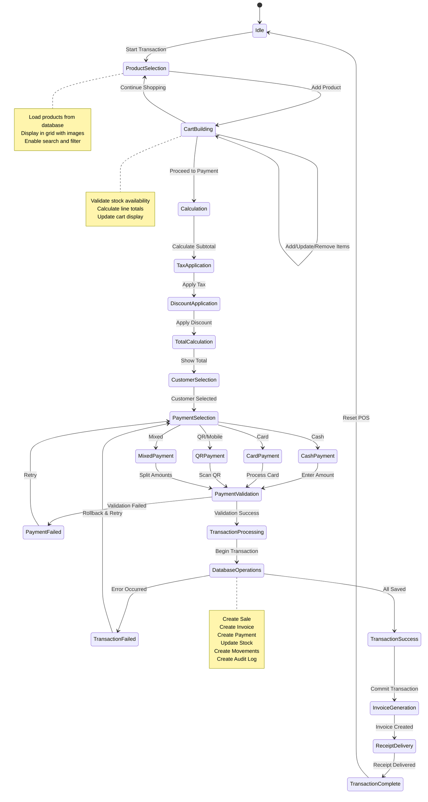

### Payment Processing Flow

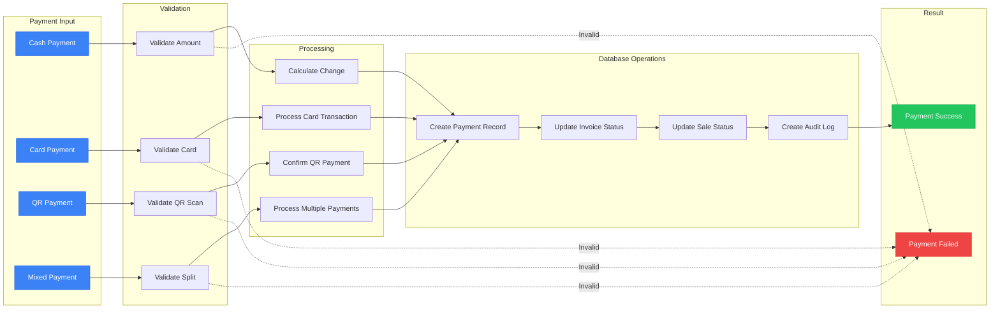

### Data Presentation by Module

```mermaid
graph TB
    subgraph "Dashboard Module"
        D1[Load User Session]
        D2[Query Sales Data]
        D3[Calculate KPIs]
        D4[Display Metrics]
        
        D1 --> D2
        D2 --> D3
        D3 --> D4
    end
    
    subgraph "POS Module"
        P1[Load Products]
        P2[Display Product Grid]
        P3[Manage Shopping Cart]
        P4[Calculate Totals]
        P5[Process Payment]
        P6[Generate Invoice]
        
        P1 --> P2
        P2 --> P3
        P3 --> P4
        P4 --> P5
        P5 --> P6
    end
    
    subgraph "Product Module"
        PR1[Query Products]
        PR2[Load Categories]
        PR3[Load Suppliers]
        PR4[Display DataGridView]
        PR5[Enable CRUD Operations]
        
        PR1 --> PR4
        PR2 --> PR4
        PR3 --> PR4
        PR4 --> PR5
    end
    
    subgraph "Customer Module"
        C1[Query Customers]
        C2[Load Purchase History]
        C3[Calculate Loyalty Points]
        C4[Display Customer List]
        C5[Enable Management]
        
        C1 --> C4
        C2 --> C4
        C3 --> C4
        C4 --> C5
    end
    
    subgraph "Reports Module"
        R1[Select Date Range]
        R2[Query Transaction Data]
        R3[Aggregate Data]
        R4[Generate Charts]
        R5[Display Analytics]
        R6[Export Options]
        
        R1 --> R2
        R2 --> R3
        R3 --> R4
        R4 --> R5
        R5 --> R6
    end
    
    style D4 fill:#3B82F6,stroke:#2563EB,color:#fff
    style P6 fill:#22C55E,stroke:#16A34A,color:#fff
    style PR5 fill:#A855F7,stroke:#9333EA,color:#fff
    style C5 fill:#EC4899,stroke:#DB2777,color:#fff
    style R6 fill:#F59E0B,stroke:#D97706,color:#fff
```

### Real-Time Data Updates

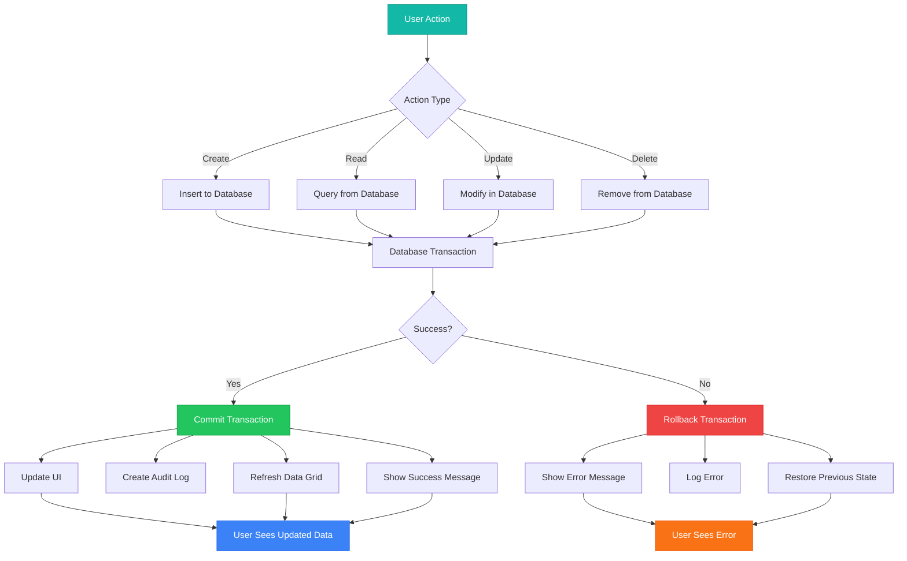

### Interface Component Hierarchy

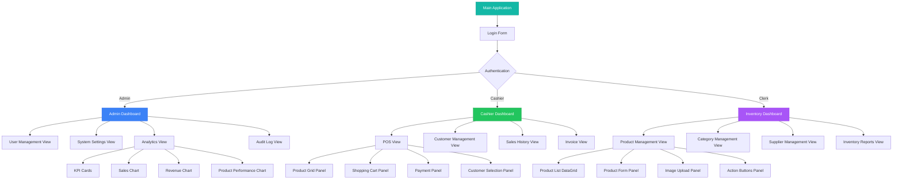

### Inventory Update Flow During Sale

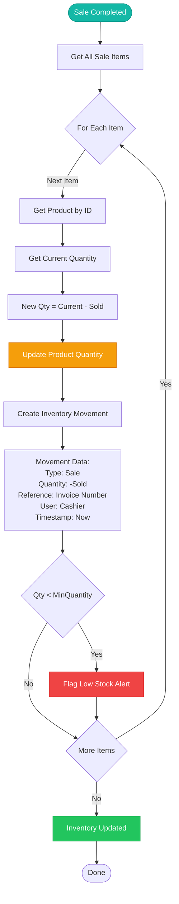

### Customer Loyalty Points Calculation

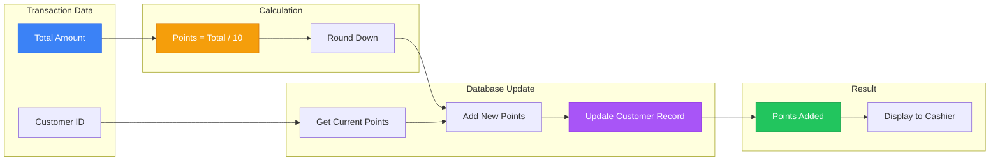

### Invoice Generation Process

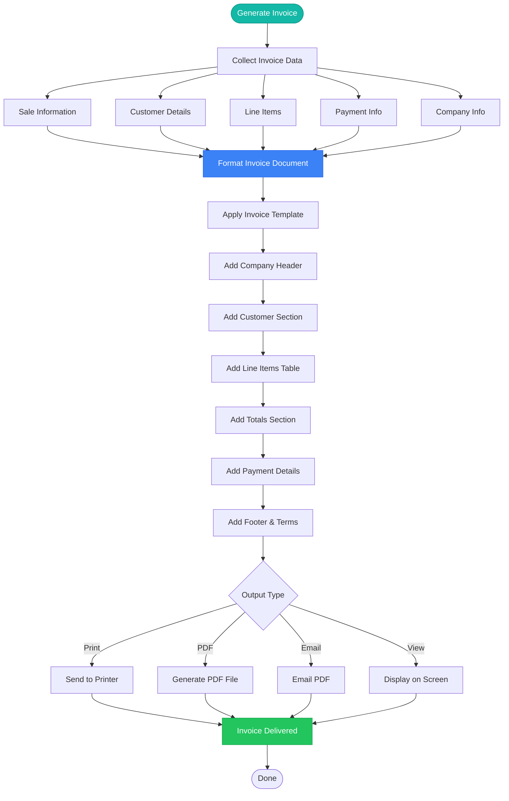

### Audit Log Creation

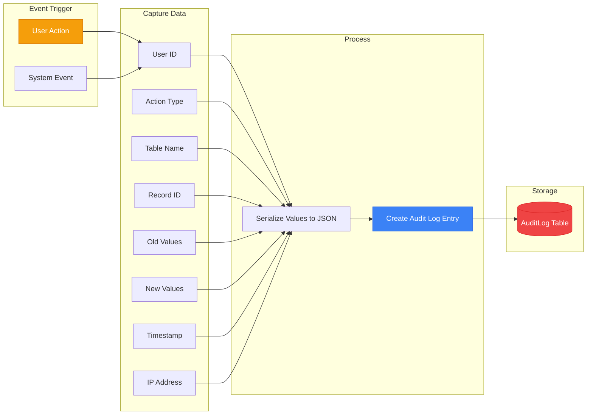

### Error Handling in POS

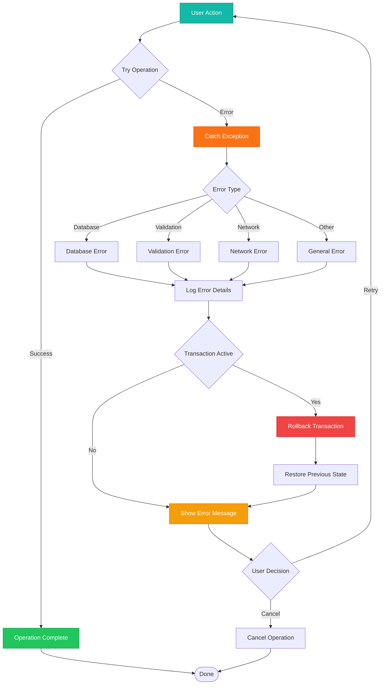

### Multi-Payment Processing

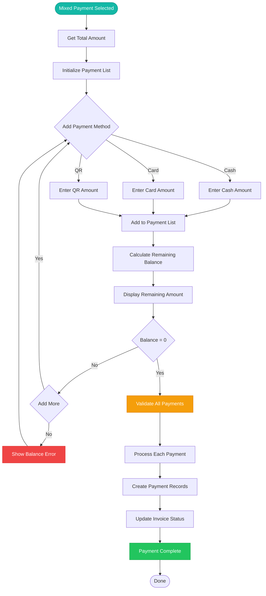

### Transaction Hold and Resume

```mermaid
flowchart LR
    subgraph "Hold Transaction"
        H1[Current Cart State]
        H2[Generate Hold Code]
        H3[Serialize Cart to JSON]
        H4[Save to HeldTransaction]
        H5[Clear Current Cart]
    end
    
    subgraph "Resume Transaction"
        R1[Enter Hold Code]
        R2[Query HeldTransaction]
        R3[Deserialize Cart JSON]
        R4[Restore Cart Items]
        R5[Restore Customer]
        R6[Restore Totals]
    end
    
    subgraph "Complete Held"
        C1[Process Payment]
        C2[Mark as Completed]
        C3[Delete Hold Record]
    end
    
    H1 --> H2
    H2 --> H3
    H3 --> H4
    H4 --> H5
    
    R1 --> R2
    R2 --> R3
    R3 --> R4
    R4 --> R5
    R5 --> R6
    
    R6 --> C1
    C1 --> C2
    C2 --> C3
    
    style H4 fill:#3B82F6,stroke:#2563EB,color:#fff
    style R4 fill:#F59E0B,stroke:#D97706,color:#fff
    style C2 fill:#22C55E,stroke:#16A34A,color:#fff
```

---

## Technology Stack

| Component | Technology | Version |
|-----------|-----------|---------|
| Framework | .NET | 8.0 |
| Language | C# | 12 |
| UI | Windows Forms | 8.0 |
| ORM | Entity Framework Core | 8.0.0 |
| Database | SQL Server | 2019+ |
| Security | BCrypt.Net-Next | 4.0.3 |
| Icons | FontAwesome.Sharp | 6.3.0 |
| UI Theme | MaterialSkin.2 | 2.1.0 |
| QR Codes | QRCoder | 1.7.0 |
| Barcode | ZXing.Net | 0.16.9 |
| PDF | QuestPDF | 2023.12.6 |

---

## Installation

### Prerequisites

- Windows 10 (1809+) or Windows 11
- .NET 8.0 Runtime
- SQL Server 2019+ or SQL Server Express
- 4 GB RAM minimum (8 GB recommended)
- 500 MB disk space

### Setup Steps

```bash
# 1. Clone repository
git clone https://github.com/yourusername/syncversestudio.git
cd syncversestudio

# 2. Restore packages
dotnet restore syncversestudio/syncversestudio.csproj

# 3. Update connection string in ApplicationDbContext.cs
# Data Source=YOUR_SERVER;Initial Catalog=POSDB;Integrated Security=True;Trust Server Certificate=True

# 4. Create database
dotnet ef database update --project syncversestudio

# 5. Build application
dotnet build syncversestudio/syncversestudio.csproj --configuration Release

# 6. Run application
dotnet run --project syncversestudio/syncversestudio.csproj
```

### Default Login

Username: vi
Password: admin123

Change password immediately after first login.

---

## Key Features

### Point of Sale

- Modern cashier interface
- Product search and filtering
- Shopping cart with real-time calculations
- Multiple payment methods (Cash, Card, QR)
- Barcode scanning support
- Invoice printing
- Transaction hold and resume

### Inventory Management

- Product CRUD operations
- Category and supplier management
- Stock level tracking
- Low-stock alerts
- Product image management
- SKU and barcode support
- Inventory movement logging

### Customer Management

- Customer profiles
- Purchase history tracking
- Loyalty points system
- Walk-in customer support
- Data encryption

### Invoicing

- Automated invoice generation
- Multiple payment methods
- Partial payment tracking
- Invoice status management
- Tax calculation
- Professional printing

### Analytics

- Real-time sales dashboard
- Revenue and profit tracking
- Sales trend visualization
- Product popularity analysis
- Inventory performance reports
- Staff performance metrics

### Security

- Role-based access control
- BCrypt password hashing
- User authentication
- Audit logging
- Customer data encryption
- Session management

---

## Permission Matrix

| Feature | Administrator | Cashier | Inventory Clerk |
|---------|--------------|---------|-----------------|
| User Management | Yes | No | No |
| Product Management | Yes | No | Yes |
| Sales Operations | Yes | Yes | No |
| Customer Management | Yes | Yes | No |
| Inventory Adjustment | Yes | No | Yes |
| Reports | All | Sales | Inventory |
| System Configuration | Yes | No | No |
| Audit Logs | Yes | No | No |

---

## Configuration

### Database Connection

Windows Authentication:
```
Data Source=SERVER_NAME;Initial Catalog=POSDB;Integrated Security=True;Trust Server Certificate=True
```

SQL Authentication:
```
Data Source=SERVER_NAME;Initial Catalog=POSDB;User Id=USERNAME;Password=PASSWORD;Trust Server Certificate=True
```

LocalDB:
```
Data Source=(localdb)\MSSQLLocalDB;Initial Catalog=POSDB;Integrated Security=True;Trust Server Certificate=True
```

### Tax Configuration

Default tax rate: 10%
Modify in POS interface using tax rate control.

### Invoice Format

Format: INV-YYYYMMDD-HHMMSS
Example: INV-20251027-143052

---

## Usage Guide

### Administrator Tasks

1. Login as Administrator
2. Navigate to User Management
3. Create user accounts with appropriate roles
4. Configure system settings
5. Monitor audit logs
6. Generate reports and analytics

### Cashier Tasks

1. Login with cashier credentials
2. Click Cashier (POS) from dashboard
3. Select customer type
4. Add products to cart
5. Review cart and totals
6. Select payment method
7. Complete transaction
8. Print or email receipt

### Inventory Clerk Tasks

1. Login with clerk credentials
2. Navigate to Products
3. Add or edit products
4. Manage categories and suppliers
5. Monitor stock levels
6. Respond to low-stock alerts
7. Generate inventory reports

---

## Deployment Scenarios

### Single Store

```mermaid
graph TD
    A[Single PC] --> B[Application]
    B --> C[SQL Server LocalDB]
    C --> D[(Database)]
    
    style A fill:#3B82F6,stroke:#2563EB,color:#fff
    style B fill:#22C55E,stroke:#16A34A,color:#fff
    style C fill:#A855F7,stroke:#9333EA,color:#fff
    style D fill:#EF4444,stroke:#DC2626,color:#fff
```

### Multi-Terminal

```mermaid
graph TD
    A[Terminal 1] --> D[Network]
    B[Terminal 2] --> D
    C[Terminal 3] --> D
    D --> E[SQL Server]
    E --> F[(Database)]
    
    style A fill:#3B82F6,stroke:#2563EB,color:#fff
    style B fill:#3B82F6,stroke:#2563EB,color:#fff
    style C fill:#3B82F6,stroke:#2563EB,color:#fff
    style D fill:#22C55E,stroke:#16A34A,color:#fff
    style E fill:#A855F7,stroke:#9333EA,color:#fff
    style F fill:#EF4444,stroke:#DC2626,color:#fff
```

---

## Project Structure

```
syncversestudio/
├── Data/
│   ├── ApplicationDbContext.cs
│   └── Migrations/
├── Models/
│   ├── User.cs
│   ├── Product.cs
│   ├── Sale.cs
│   ├── Invoice.cs
│   └── ...
├── Services/
│   ├── AuthenticationService.cs
│   └── DatabaseInitializer.cs
├── Views/
│   ├── LoginForm.cs
│   ├── MainDashboard.cs
│   └── CashierDashboard/
├── Helpers/
│   ├── ProductImageHelper.cs
│   └── BrandTheme.cs
└── Program.cs
```

---

## Development

### Build Commands

```bash
# Clean
dotnet clean syncversestudio/syncversestudio.csproj

# Restore
dotnet restore syncversestudio/syncversestudio.csproj

# Build Debug
dotnet build syncversestudio/syncversestudio.csproj --configuration Debug

# Build Release
dotnet build syncversestudio/syncversestudio.csproj --configuration Release

# Run
dotnet run --project syncversestudio/syncversestudio.csproj
```

### Database Migrations

```bash
# Create migration
dotnet ef migrations add MigrationName --project syncversestudio

# Apply migration
dotnet ef database update --project syncversestudio

# Remove migration
dotnet ef migrations remove --project syncversestudio

# Generate SQL script
dotnet ef migrations script --project syncversestudio --output migration.sql
```

---

## Security Features

### Authentication

- BCrypt password hashing (work factor 11)
- Automatic salt generation
- No plain text storage
- Session tracking

### Authorization

- Role-based access control
- Permission enforcement
- Feature-level restrictions

### Data Protection

- Customer data encryption
- Payment information protection
- API key encryption

### Audit Trail

All operations logged:
- User login/logout
- Data modifications
- Transactions
- Payments
- Inventory adjustments
- System changes

---

## Performance

| Operation | Time | Notes |
|-----------|------|-------|
| Application Startup | 2-3s | First launch slower |
| User Login | <1s | BCrypt verification |
| Dashboard Load | 1-2s | 1000+ transactions |
| Product Search | <500ms | 10,000+ products |
| Add to Cart | <100ms | Real-time |
| Complete Transaction | 1-2s | Database writes |
| Invoice Generation | <1s | PDF creation |
| Report Generation | 2-5s | Date range dependent |

### Scalability

- Products: 50,000+
- Transactions: 100,000+
- Customers: 10,000+
- Concurrent Users: 5-10
- Database Size: Up to 10 GB

---

## Troubleshooting

### Application won't start

- Verify .NET 8.0 Runtime installed
- Check database connection string
- Ensure SQL Server running
- Review application logs

### Database connection failed

- Verify SQL Server accessible
- Check connection string format
- Ensure database exists
- Verify user permissions

### Login fails

- Check user account active
- Verify credentials
- Review audit logs
- Ensure database accessible

### Products not showing images

- Verify image files exist
- Check file permissions
- Validate ImagePath
- Check file formats (JPG, PNG)

---

## Backup and Restore

### Manual Backup

```bash
# Backup
sqlcmd -S SERVER_NAME -E -Q "BACKUP DATABASE POSDB TO DISK='C:\Backup\POSDB.bak' WITH FORMAT"

# Restore
sqlcmd -S SERVER_NAME -E -Q "RESTORE DATABASE POSDB FROM DISK='C:\Backup\POSDB.bak' WITH REPLACE"
```

### Automated Backup

Schedule SQL Server Agent job for daily backups at 2 AM:

```sql
BACKUP DATABASE POSDB
TO DISK = 'C:\Backups\POSDB_' + CONVERT(VARCHAR, GETDATE(), 112) + '.bak'
WITH FORMAT, COMPRESSION, STATS = 10;
```

---

## Contributing

### Process

1. Fork repository
2. Create feature branch
3. Make changes
4. Test thoroughly
5. Commit with clear messages
6. Push to fork
7. Submit pull request

### Commit Format

```
<type>(<scope>): <subject>

<body>

<footer>
```

Types: feat, fix, docs, style, refactor, test, chore

Example:
```
feat(pos): Add QR code payment support

Implemented QR code generation for mobile payments.

Closes #123
```

---

## Roadmap

### Version 1.1 (Q1 2026)

- Barcode scanner hardware integration
- Receipt printer integration
- Email notifications
- SMS notifications
- Advanced charts
- PDF reports
- Excel export

### Version 1.2 (Q2 2026)

- Multi-language support
- Dark mode
- Mobile app
- Cloud backup
- Enhanced analytics
- Loyalty program improvements
- Discount system

### Version 2.0 (Q3 2026)

- E-commerce integration
- Multi-store support
- Franchise management
- Inventory forecasting
- AI sales predictions
- Customer analytics
- Automated reordering

---

## License

MIT License

Copyright (c) 2025 SYNCVERSE STUDIO

Permission is hereby granted, free of charge, to any person obtaining a copy of this software and associated documentation files (the "Software"), to deal in the Software without restriction, including without limitation the rights to use, copy, modify, merge, publish, distribute, sublicense, and/or sell copies of the Software, and to permit persons to whom the Software is furnished to do so, subject to the following conditions:

The above copyright notice and this permission notice shall be included in all copies or substantial portions of the Software.

THE SOFTWARE IS PROVIDED "AS IS", WITHOUT WARRANTY OF ANY KIND, EXPRESS OR IMPLIED, INCLUDING BUT NOT LIMITED TO THE WARRANTIES OF MERCHANTABILITY, FITNESS FOR A PARTICULAR PURPOSE AND NONINFRINGEMENT. IN NO EVENT SHALL THE AUTHORS OR COPYRIGHT HOLDERS BE LIABLE FOR ANY CLAIM, DAMAGES OR OTHER LIABILITY, WHETHER IN AN ACTION OF CONTRACT, TORT OR OTHERWISE, ARISING FROM, OUT OF OR IN CONNECTION WITH THE SOFTWARE OR THE USE OR OTHER DEALINGS IN THE SOFTWARE.

---

## Support

### Documentation

Additional guides in GUIDE/ folder:
- Quick Start Guide
- Technology Stack
- Project Structure
- Brand Theme Guide
- Security Policy
- Deployment Checklist
- Migration Guide
- Analytics Feature
- Enhanced POS Documentation

### Contact

- Repository: https://github.com/EIRSVi/sync-verse-studio
- Issues: https://github.com/EIRSVi/sync-verse-studio/issues
- Email: support@syncverse.com

---

## Acknowledgments

### Development Team

Lead Developer: Vi

Contributors:
- PHA***NAK (100034879410842)
- pha******nn (100006581647309)
- Sa***Dy (100028267065321)
- CH****KLA (100074770834689)
- Ph****nna (100057666978328)

### Technologies

Special thanks to:
- Microsoft (.NET, Entity Framework Core)
- Open-source community
- All contributors and testers

---

SYNCVERSE STUDIO - Empowering Retail Excellence

Version 1.0.0 | October 2025
